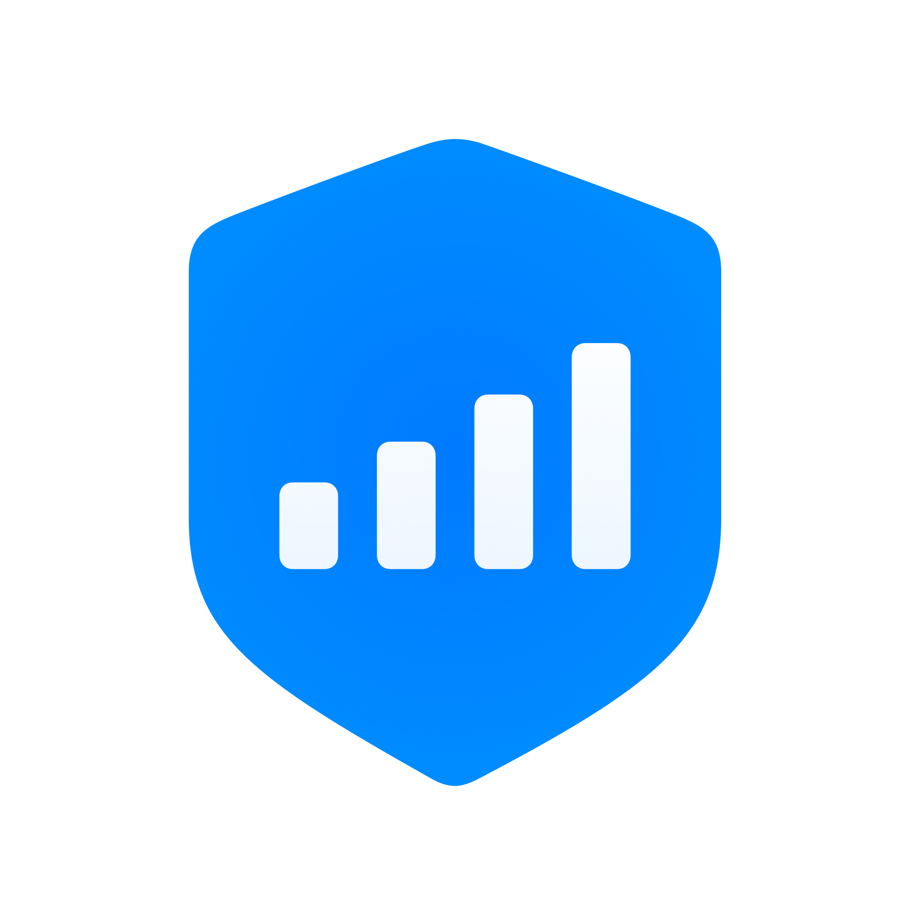

# CellGuard

The CellGuard iOS app alerts users about possible rogue base stations nearby.

The repository consists of seven directories:
- [AnalyzeCells](./AnalyzeCells): A Python script to evaluate multiple exported datasets
- [CaptureCellsTweak](./CaptureCellsTweak): The tweak injected into iOS collecting cells the iPhone connects to
- [CapturePacketsTweak](./CapturePacketsTweak): The tweak injected into iOS collecting binary QMI and ARI packets
  - iOS and the iPhone's baseband utilize them for communication
- [CellGuard](./CellGuard): The CellGuard iOS app
- [Icon](./Icon): CellGuard branding assets
- [IosUnifiedLogs](./IosUnifiedLogs): A proof-of-concept iOS app for parsing system diagnoses on device
- [src](./src): The Rust source code for the CellGuard iOS app
