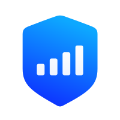
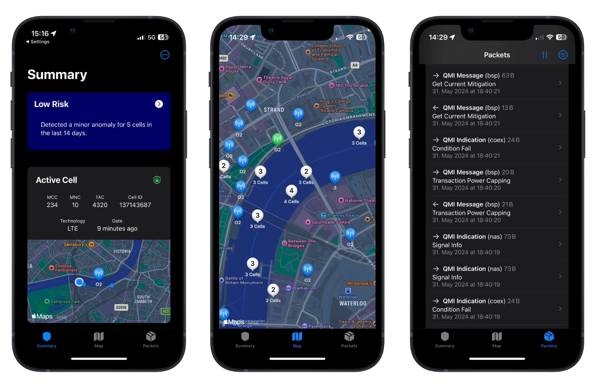

# CellGuard

CellGuard is a research project that analyzes how cellular networks are operated and possibly surveilled. 
The CellGuard app for iOS can uncover cellular attacks targeting your iPhone. 
It observes baseband packets and analyzes them for suspicious activities, hinting at rogue base stations. 
Let's catch them all!

Read more about CellGuard and download the app at [our website](https://cellguard.seemoo.de).

Explore the iOS-baseband-interface with our [BaseTrace](https://github.com/seemoo-lab/BaseTrace) framework.

## Contributing

You can contribute to the app's development by 
* Testing CellGuard on own iPhone with [TestFlight](https://cellguard.seemoo.de/docs/install/)
* Providing feedback using [Discussions](https://github.com/seemoo-lab/CellGuard/discussions)
* Reporting issues & crashes using [TestFlight](https://cellguard.seemoo.de/docs/report-issues/) or [Issues](https://github.com/seemoo-lab/CellGuard)
* Submitting new features & bug fixes using [Pull Requests](https://github.com/seemoo-lab/CellGuard/pulls)

## Structure

The repository consists of six directories
- [AnalyzeCells](./AnalyzeCells): A Python script to evaluate datasets exported from CellGuard
- [CaptureCellsTweak](./CaptureCellsTweak): A tweak injected into iOS collecting cells an iPhone connects to
- [CapturePacketsTweak](./CapturePacketsTweak): A tweak injected into iOS collecting binary QMI and ARI packets
- [CellGuardAppRust](./CellGuardAppRust): The Rust extension for the CellGuard iOS app
- [CellGuardAppSwift](./CellGuardAppSwift): The CellGuard iOS app written in Swift

## Publications

- [Lukas Arnold, Matthias Hollick, Jiska Classen (2024): **Catch You Cause I Can: Busting Rogue Base Stations using CellGuard and the Apple Cell Location Database**](https://doi.org/10.1145/3678890.3678898)
