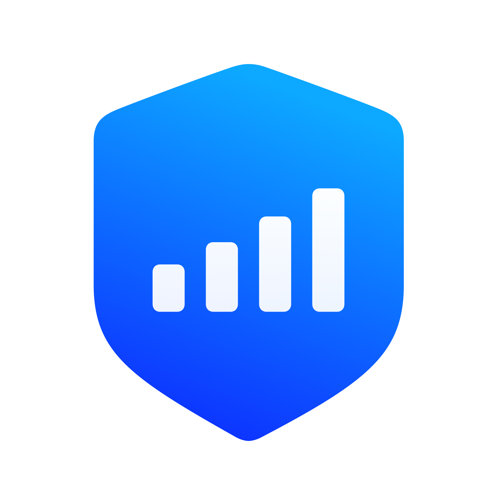

# CellGuard

CellGuard is a research project that analyzes how cellular networks are operated and possibly surveilled. 
The CellGuard app for iOS can uncover cellular attacks targeting your iPhone. 
It observes baseband packets and analyzes them for suspicious activities, hinting at rogue base stations. 
Let's catch them all!

Read more about CellGuard at [our website](https://cellguard.seemoo.de).

You can contribute to the app's development by 
* Testing CellGuard on own iPhone with [TestFlight](https://cellguard.seemoo.de/docs/install/)
* Providing feedback using [discussions](https://github.com/seemoo-lab/CellGuard/discussions)
* Reporting issues & crashes using [TestFlight](https://cellguard.seemoo.de/docs/report-issues/) or [issues](https://github.com/seemoo-lab/CellGuard)
* Submitting new features & bug fixes using [pull requests](https://github.com/seemoo-lab/CellGuard/pulls)

The repository consists of six directories:
- [AnalyzeCells](./AnalyzeCells): A Python script to evaluate multiple exported datasets
- [CaptureCellsTweak](./CaptureCellsTweak): The tweak injected into iOS collecting cells the iPhone connects to
- [CapturePacketsTweak](./CapturePacketsTweak): The tweak injected into iOS collecting binary QMI and ARI packets
- [CellGuardAppRust](./CellGuardAppRust): The Rust extension for the CellGuard iOS app
- [CellGuardAppSwift](./CellGuardAppSwift): The CellGuard iOS app written in Swift
